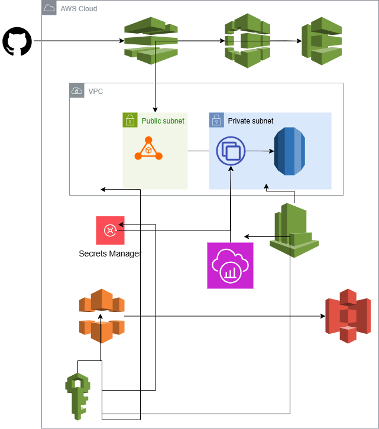

## Scalable SaaS Web Application Deployment with AWS CI/CD and Monitoring
Modern companies struggle to deploy and maintain scalable, secure, and continuously updated web apps. This project solves that by providing a template architecture for automated, secure, and monitored app delivery.
## Project Goal
Build and deploy a 3-tier web application (Frontend + Backend + Database) on AWS with a fully automated CI/CD pipeline and monitoring setup.
## Architecture diagram
